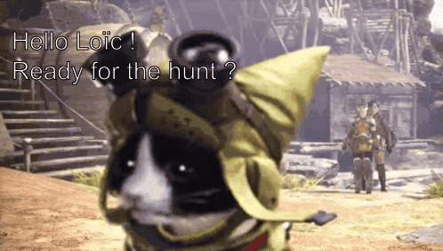

# Quest Quill

Quest Quill est un projet développé pour le cours "Réseaux de Neurones" dispensé par Loïc Grobol à l'Université Paris Nanterre. Il vise à générer des quêtes de jeu de rôle (JDR) en utilisant des réseaux neuronaux.
Suivez ce lien pour avoir plus ample connaissance de la manière dont a été créer le modèle : https://kittog.github.io/quest-quill/




## Table des matières

- [Introduction](#introduction)
- [Fonctionnalités](#fonctionnalités)
- [Installation](#installation)
- [Utilisation](#utilisation)
- [Contributions](#contributions)
- [Licence](#licence)

## Introduction

Quest Quill est conçu pour aider les maîtres de jeu (MJ) à créer des quêtes captivantes pour leurs campagnes de JDR. En utilisant des réseaux neuronaux, l'outil génère des contours de quête, comprenant des objectifs, des personnages et des paramètres, fournissant ainsi de l'inspiration pour que les MJ développent davantage des quêtes complètes.

## Fonctionnalités

- **Génération de quêtes** : Génère automatiquement des contours de quête en fonction de paramètres prédéfinis et de modèles de réseaux neuronaux.
- **Personnalisation** : Permet la personnalisation des paramètres de quête tels que la difficulté, le cadre et le type de quête.

## Installation

Pour installer Quest Quill, suivez ces étapes :

1. Clonez le dépôt : `git clone git@github.com:kittog/quest-quill.git`
2. Accédez au répertoire du projet : `cd quest-quill`
3. Installez les dépendances : `pip install -r requirements.txt`
## Utilisation

Pour utiliser Quest Quill, suivez ces étapes :

1. Télecharger le modèle disponible sur wetransfer
2. Accédez au dossier de l'api `cd/api`
3. Dezipper le fichier .rar telecharger sur wetransfer dans le dossier api
4. Exécutez l'application : ``` python -m uvicorn main:app --reload```
5. Suivez les invites pour spécifier les paramètres de la quête tels que la difficulté, le cadre et le type de quête.
6. Votre quête est générée :) nous esperons qu'elle vous plaît !

